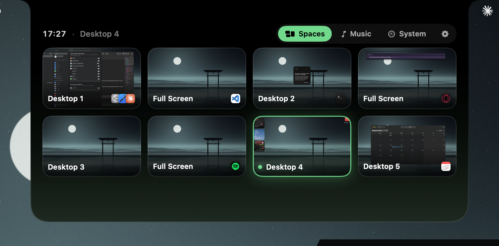
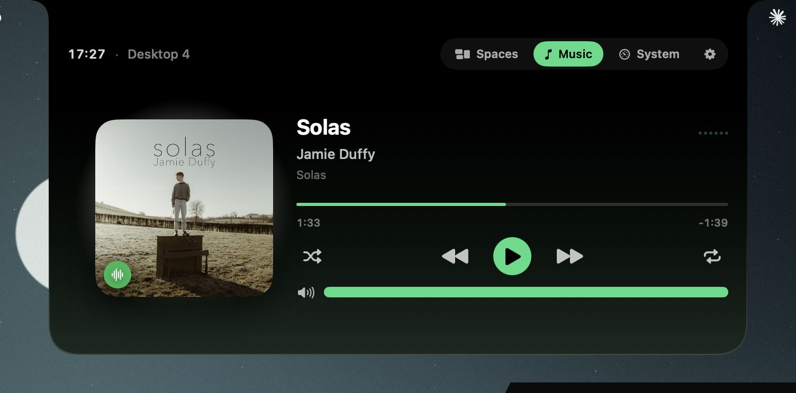
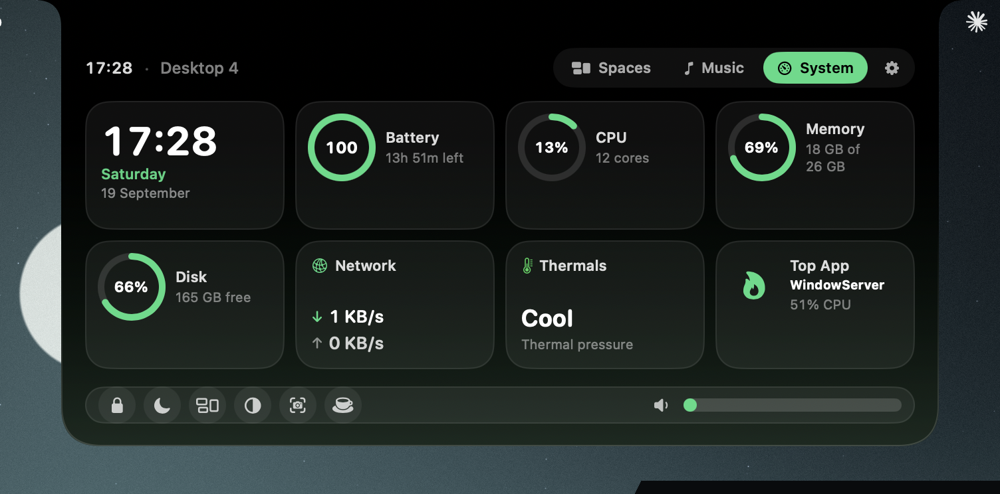
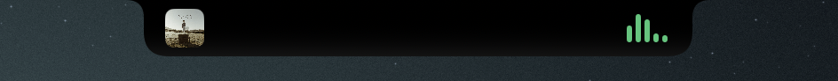

<p align="center">
  
</p>

<h1 align="center">NotchDeck</h1>

<p align="center">
  <b>Your notch, upgraded.</b><br>
  Hover the MacBook notch and it opens into a deck: every desktop with a live preview, your music, your Mac's vitals. One glance, one click, gone again.
</p>

<p align="center">
  <a href="https://notchdeck-kappa.vercel.app"></a>
  <a href="https://github.com/coderbee2023/NotchDeck/releases/latest"></a>
  
  
  <a href="LICENSE"></a>
</p>

<p align="center">
  
</p>

## What it does

| | |
|---|---|
| **Spaces** — jump straight to any desktop | Every desktop and full-screen app on the display, with a live preview and the icons of what's running there. Click a card and you're there — no sliding through the ones in between. Direct jumps use Mission Control's own `⌃1`–`⌃9`, which NotchDeck enables for you. Each display lists its own desktops. |
| **Music** — Spotify & Apple Music | Artwork that glows to the beat, scrubbing, shuffle, repeat and a volume bar. While it plays, the closed notch shows the cover and a waveform. |
| **System** — your Mac's vitals | Pick the widgets you want: clock, battery with time remaining, CPU, memory, disk, network, thermals, the hungriest app, uptime. A dock with lock, sleep display, Mission Control, dark mode, screenshot, keep-awake and the system volume. |
| **Settings** | Six accent presets or any hue, glass brightness, tint, hover delay, launch at login, which widgets show. |

<p align="center">
  &nbsp;
  
</p>
<p align="center">
  
</p>

- `⌃⌥Space` opens the deck on the screen your cursor is on, `Esc` closes it, two-finger swipe changes page.
- Screens without a physical notch get a slim virtual one, so external displays work too.
- Menu-bar app, no Dock icon. Closed, it's exactly the size of the notch.
- Nothing leaves your Mac: previews are captured locally and kept in memory. No accounts, no analytics.

## Install

1. Download the latest `.dmg` from [Releases](https://github.com/coderbee2023/NotchDeck/releases/latest) (or the [website](https://notchdeck-kappa.vercel.app)).
2. Drag **NotchDeck** into *Applications* and open it.
3. The welcome window walks you through permissions. Hover the notch.

Requires macOS 14 Sonoma or later. Works on Apple silicon and Intel.

## Permissions — and why

| Permission | Used for | Optional? |
|---|---|---|
| **Accessibility** | Pressing Mission Control's "Switch to Desktop n" shortcut when you click a card. Nothing is read from other apps. | Without it, cards can't switch desktops. |
| **Screen Recording** | The live previews in the Spaces page — still captures, kept in memory only. | Without it you get cards with app icons. |
| **Automation** (Spotify / Music) | Playback control through AppleScript. Asked the first time you press play. | Without it the Music page is empty. |

## Build from source

```bash
git clone https://github.com/coderbee2023/NotchDeck.git
cd NotchDeck
open NotchDeck.xcodeproj      # Xcode 15+, press ⌘R
```

The Debug build includes a small file-based debug bridge (`DebugBridge.swift`, `#if DEBUG` only) that the release build strips. `build-release.sh` produces a signed, notarized DMG when a *Developer ID Application* certificate and a `notchdeck` notarytool keychain profile are present.

## How it works (short version)

- The deck is an `NSPanel` at screen-saver level that joins all Spaces; hover tracking runs on a 30 Hz timer against the notch rectangle.
- Spaces are enumerated per display with the private `CGSCopyManagedDisplaySpaces`; switching only ever uses macOS's own Mission Control shortcuts (`⌃n` / `⌃←` `⌃→`) posted as session-level key events, or raising the window for full-screen spaces. No private "set space" calls — that path never repaints reliably.
- Previews come from ScreenCaptureKit: the visible desktop as a display capture, other desktops composited from per-window captures over the wallpaper.
- Music talks to Spotify and Apple Music over AppleScript; the artwork glow is a Core Image blur.
- SwiftUI for the whole UI, `SMAppService` for launch at login.

## Roadmap

- Now Playing for browsers and other players (macOS makes this hard for third parties since 15.4).
- Brightness slider, per-display Space renaming, Sparkle updates.

## License

MIT © 2026 Wassim Djobbi
