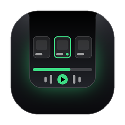
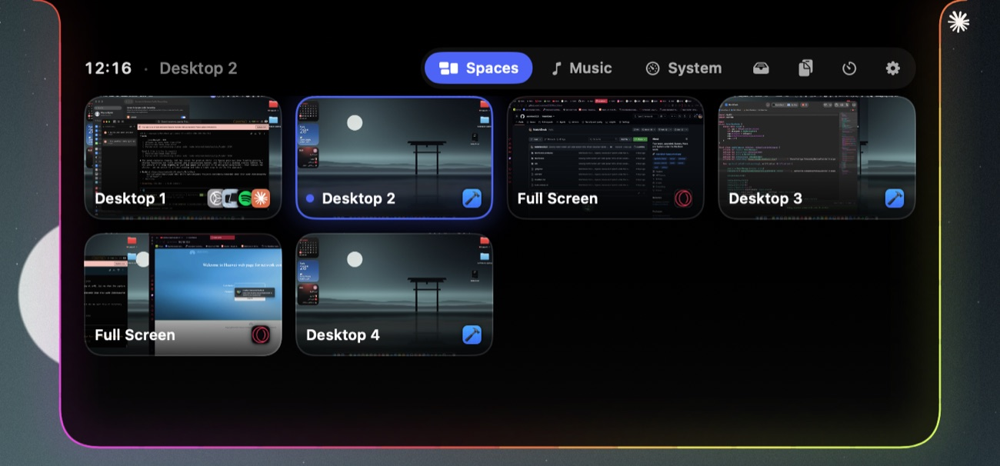
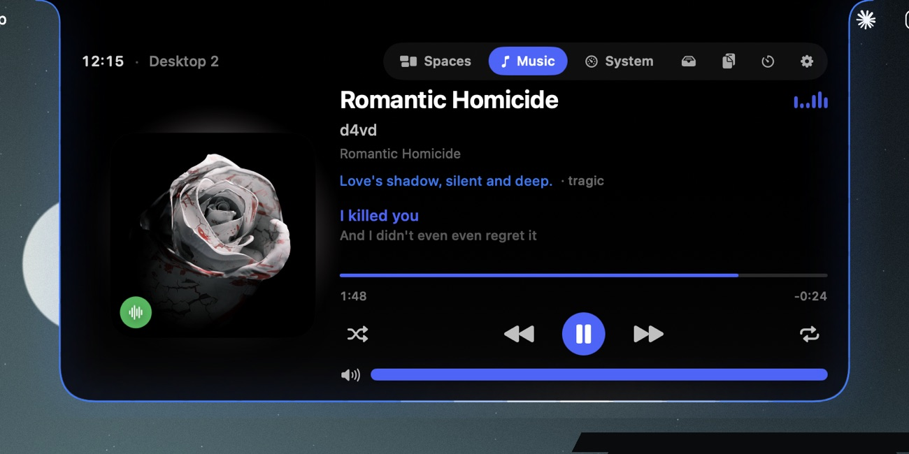
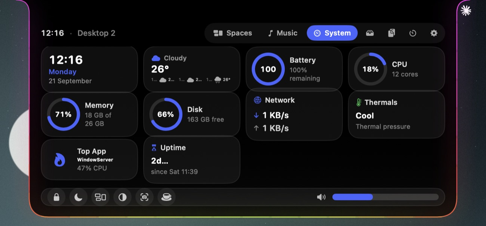
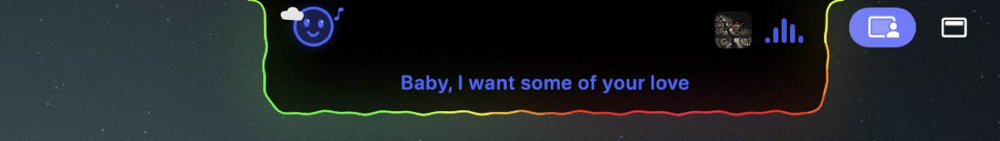

<p align="center">
  
</p>

<h1 align="center">NotchDeck</h1>

<p align="center">
  <b>Your notch, alive.</b><br>
  Hover the MacBook notch and it opens into a deck — every desktop with a live preview, your music, your Mac's vitals, weather, clipboard and more. Closed, it wears a glowing border that breathes with whatever you're doing.
</p>

<p align="center">
  <a href="https://notchdeck-kappa.vercel.app"></a>
  <a href="https://github.com/coderbee2023/NotchDeck/releases/latest"></a>
  
  
  <a href="LICENSE"></a>
</p>

<p align="center">
  
</p>

## What's in the deck

Seven pages, one two-finger swipe apart. Everything lives under the notch, so it never steals a pixel until you ask for it.

| | |
|---|---|
| **Spaces** — jump straight to any desktop | Every desktop and full-screen app on the display, with a live preview and the icons of what's running there. Click a card and you're there — no sliding through the ones between. Direct jumps use Mission Control's own `⌃1`–`⌃9`, which NotchDeck enables for you. Each display lists its own desktops. |
| **Music** — Spotify & Apple Music | Artwork, scrubbing, shuffle, repeat and volume — plus live lyrics under the notch and an AI-written line about the vibe. While it plays, the closed notch shows the cover and a waveform. |
| **System** — your Mac's vitals | Pick the widgets you want: clock, weather, battery with time remaining, CPU, memory, disk, network, thermals, the hungriest app, uptime. A dock with lock, sleep, Mission Control, dark mode, screenshot, keep-awake and system volume. |
| **Shelf** — files in transit | Drag files onto the notch to park them, then AirDrop, zip, copy or send them to Downloads. A staging area that follows you across every desktop. |
| **Clipboard** — copy history | Everything you copy — links, snippets, colors, notes. Click to paste, ⇧-click to just copy, pin the ones you reuse. Never leaves your Mac. |
| **Timer** — a countdown in the notch | Pick a length or a Pomodoro; the countdown rides in the collapsed notch while you work, with a focused face and a ring winding down. |
| **Settings** | Accent presets or any hue, glass brightness, tint, hover delay, the glow border, the face, launch at login, which widgets show. |

<p align="center">
  &nbsp;
  
</p>

## A notch that's alive

Closed, the notch isn't just a black rectangle — it reacts to what's happening.

- **A living face** — a hand-drawn face that vibes to music, gets sleepy at night, runs hot when the Mac does, winks when you screenshot, and goes alert when the camera or mic turns on.
- **Wears the weather** — live local weather in the System page and as a tiny scene beside the face (sun, clouds, rain, thunderstorm), reconciled against the real sky so it doesn't cry wolf.
- **A glowing border** — takes its color from your accent, a custom swatch, the album art, your wallpaper, or the song's mood, and moves the way you like: breathe, pulse, flow, comet, rainbow or solid. It can wave to the beat.
- **Song Mood, on-device** — NotchDeck asks Apple Intelligence's on-device model what a track *feels* like and paints the border, a caption and the face to match. No servers, no account, nothing leaves your Mac.
- **Charging, alive** — plug in and a bright surge is born at the bottom of the border and races out to both sides, a heartbeat of light, while a battery ring fills.

<p align="center">
  
</p>

- `⌃⌥Space` opens the deck on the screen your cursor is on, `Esc` closes it, two-finger swipe changes page.
- Screens without a physical notch get a slim virtual one, so external displays work too.
- Menu-bar app, no Dock icon. Closed, it's exactly the size of the notch.
- Nothing leaves your Mac: previews are captured locally and kept in memory, and the mood model runs on-device. No accounts, no analytics.

## Install

1. Download the latest `.dmg` from [Releases](https://github.com/coderbee2023/NotchDeck/releases/latest) (or the [website](https://notchdeck-kappa.vercel.app)).
2. Drag **NotchDeck** into *Applications* and open it.
3. The welcome window walks you through permissions. Hover the notch.

Requires macOS 14 Sonoma or later. Works on Apple silicon and Intel. The on-device Song Mood needs Apple Intelligence on supported hardware; without it, the glow falls back to the album-art color.

## Permissions — and why

| Permission | Used for | Optional? |
|---|---|---|
| **Accessibility** | Pressing Mission Control's "Switch to Desktop n" shortcut when you click a card. Nothing is read from other apps. | Without it, cards can't switch desktops. |
| **Screen Recording** | The live previews in the Spaces page — still captures, kept in memory only. | Without it you get cards with app icons. |
| **Automation** (Spotify / Music) | Playback control through AppleScript. Asked the first time you press play. | Without it the Music page is empty. |
| **Apple Intelligence** | The song-mood color, caption and face, via on-device Foundation Models. Runs entirely on your Mac. | Without it, the glow uses the album-art color. |

## Build from source

```bash
git clone https://github.com/coderbee2023/NotchDeck.git
cd NotchDeck
open NotchDeck.xcodeproj      # Xcode 15+, press ⌘R
```

The Debug build includes a small file-based debug bridge (`DebugBridge.swift`, `#if DEBUG` only) that the release build strips. `build-release.sh` produces a signed, notarized DMG when a *Developer ID Application* certificate and a `notchdeck` notarytool keychain profile are present.

## How it works (short version)

- The deck is an `NSPanel` at screen-saver level that joins all Spaces; hover tracking runs on a 30 Hz timer against the notch rectangle.
- Spaces are enumerated per display with the private `CGSCopyManagedDisplaySpaces`; switching only ever uses macOS's own Mission Control shortcuts (`⌃n` / `⌃←` `⌃→`) posted as session-level key events, or raising the window for full-screen spaces. No private "set space" calls — that path never repaints reliably.
- Previews come from ScreenCaptureKit: the visible desktop as a display capture, other desktops composited from per-window captures over the wallpaper.
- Music talks to Spotify and Apple Music over AppleScript; the album-art glow is a Core Image blur; lyrics stream from a lyrics provider.
- Song Mood uses Apple's on-device **FoundationModels** to read a `mood`, color, emoji, energy and caption per track, cached per song and reconciled with the album-art color.
- Weather comes from Open-Meteo, reconciled against live cloud-cover so it matches the real sky.
- SwiftUI for the whole UI, `SMAppService` for launch at login.

## Roadmap

- Now Playing for browsers and other players (macOS makes this hard for third parties since 15.4).
- Brightness slider, per-display Space renaming, Sparkle updates.

## License

MIT © 2026 Wassim Djobbi
